<h1 align="center">基于Spring Boot 的茶叶商城系统系统【带论文】</h1>

- <b>完整代码获取地址：从戎源码网 ([https://armycodes.com/](https://armycodes.com/))</b>
- <b>技术探讨、资料分享，请加QQ群：692619798</b>
- <b>作者微信：19941326836  QQ：3645296857</b>
- <b>承接计算机毕业设计、Java毕业设计、Python毕业设计、深度学习、机器学习</b>
- <b>选题+开题报告+任务书+程序定制+安装调试+论文+答辩ppt 一条龙服务</b>
- <b>所有选题地址 ([https://github.com/Descartes007/allProject](https://github.com/Descartes007/allProject)) </b>

## 一、项目介绍

### 基于 Spring Boot 的茶叶商城系统，系统角色为管理员与顾客（含 VIP 管理模块），主要功能如下
### 管理员：
- 基本操作：登录、修改密码、获取个人信息、修改个人信息
- 用户与权限管理：筛选用户、查看/删除用户详情、授权用户、用户状态管理、角色管理（新增/修改/删除/查询/权限查看）、用户-角色关联管理
- 商品与规格管理：分类/规格管理、查看分类与规格、商品管理（新增/修改/删除/查询）、商品与规格关联管理、批量添加规格项
- 商品评价管理：新增/修改/删除/查询商品评价
- 购物与订单管理：查看订单详情、订单明细管理、订单相关统计（含退货/退款处理接口）
- 购物车管理：查询购物车、添加/更新/删除购物车项、按用户清空购物车
- 售后与退货管理：退货原因管理（增删改查）、退货申请处理（新增/更新/拒绝/退款/收货/发回等流程）、退货记录查询与统计
- 物流管理：添加/删除物流信息、查询物流信息
### 采购与供应链管理：供应商管理（增删改查/可用查询）、采购单管理（增删改查/收货/列表查询/统计）
- VIP/会员管理：VIP 信息增删改查、会员查询与校验
### 顾客（普通用户）：
- 基本操作：注册、登录、修改密码、获取/修改个人信息
- 商品浏览：商品分类浏览、首页并行加载分类与商品列表、商品详情查看、规格选择
### 购物流程：加入购物车、购物车查看与编辑、下单（生成订单）、查看订单明细
- 评价与售后：提交商品评价、申请退货/查看退货进度
- VIP 功能：查看/申请 VIP（会员）相关信息

## 二、项目技术

- 编程语言：Java（后端）；JavaScript（前端）
- 项目架构：B/S 架构，前后端分离
- 前端技术：Vue.js、Axios、Node/npm

## 三、运行环境

- JDK版本：1.8及以上都可以
- 操作系统：Windows7/10、MacOS
- 开发工具：IDEA、Ecplise、MyEclipse都可以

## 四、数据库配置文件

- npm版本：6.14.13及以上都可以
- Redis版本：3.2.100及以上都可以
- 文件名：application.yml、application-jdbc.yml、application-mail.yml、application-redis.yml
- 编码类型：utf8

## 论文截图

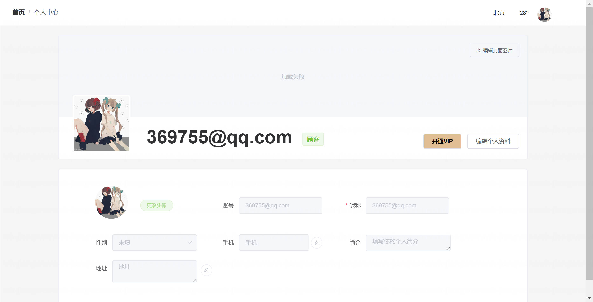

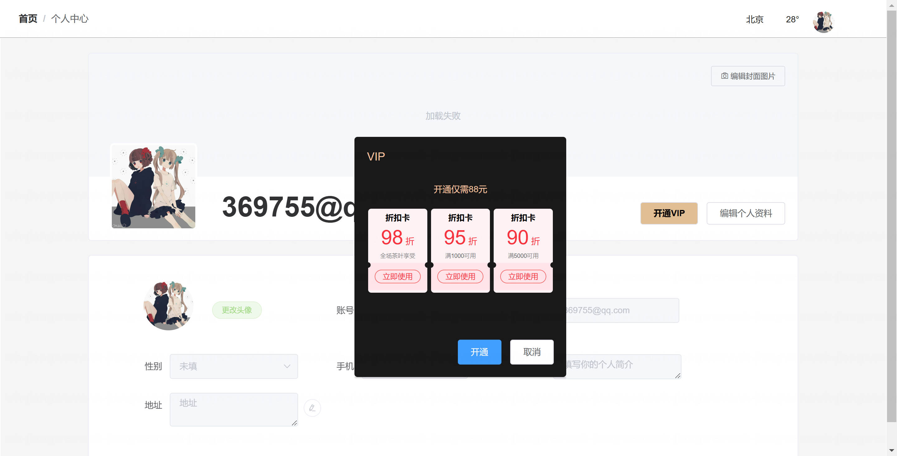

## 系统截图

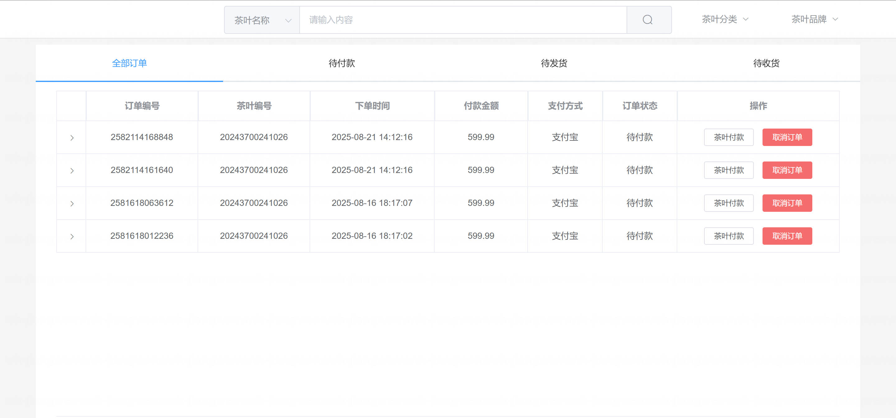

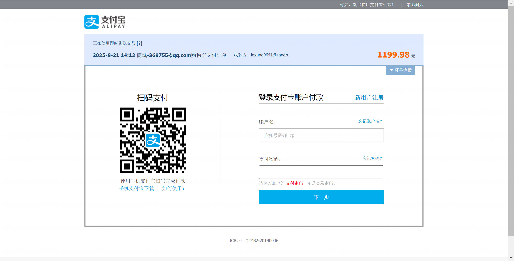

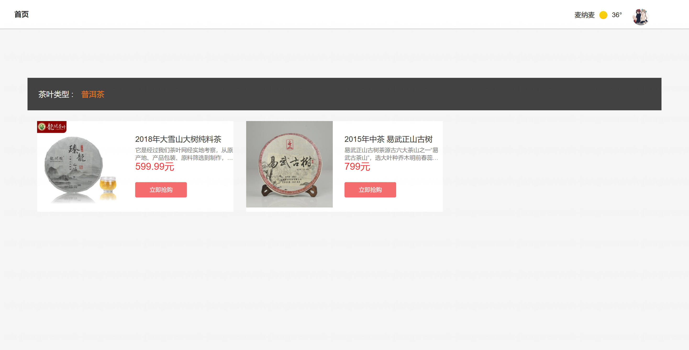

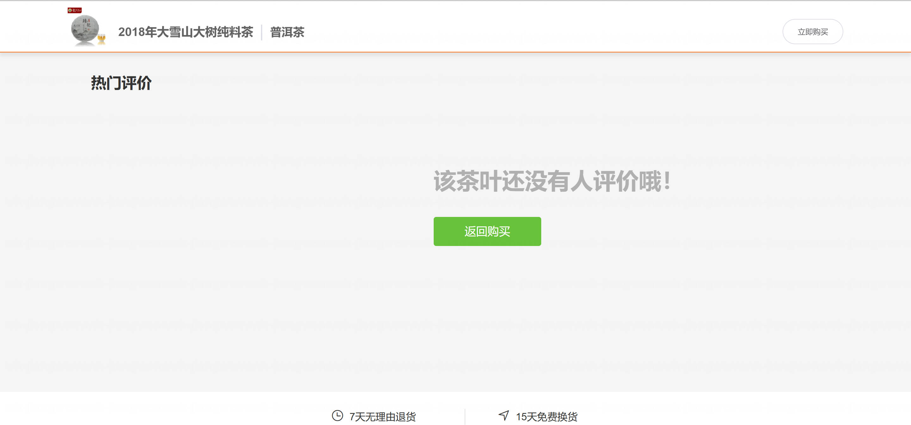

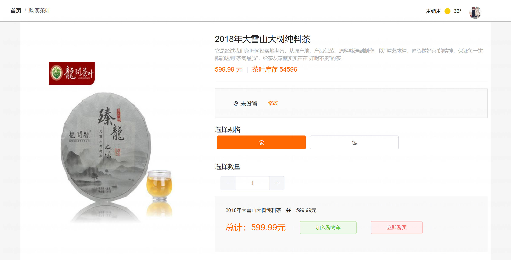

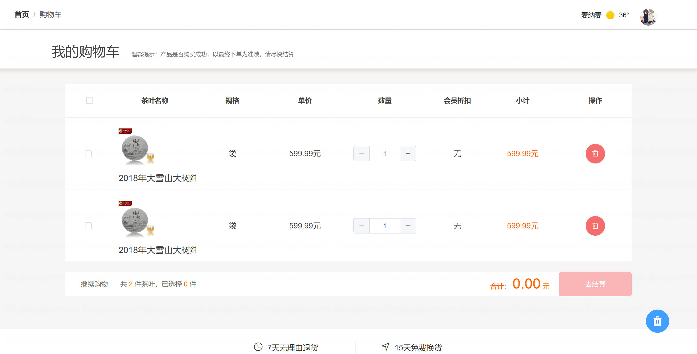

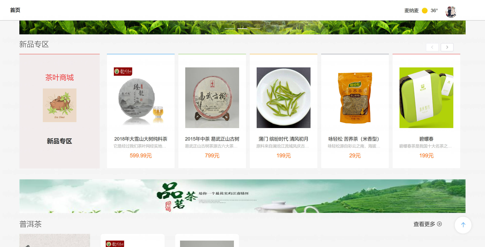

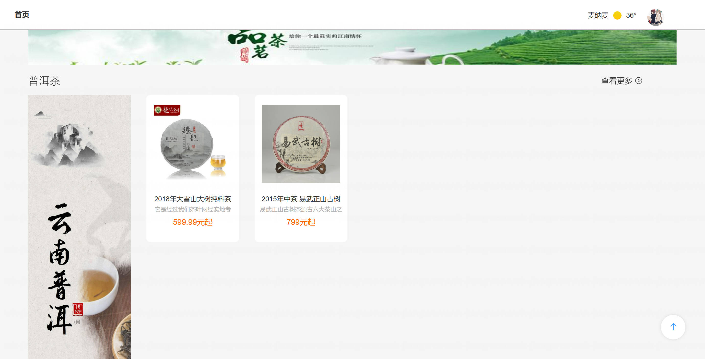

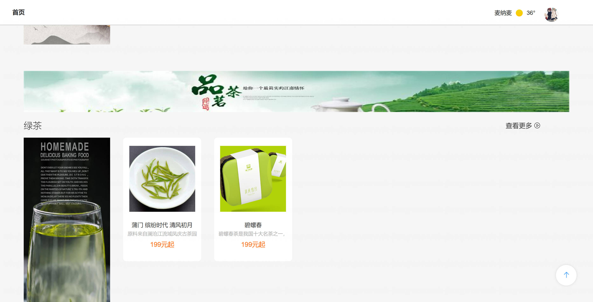